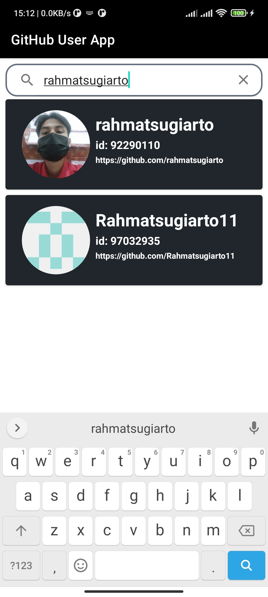
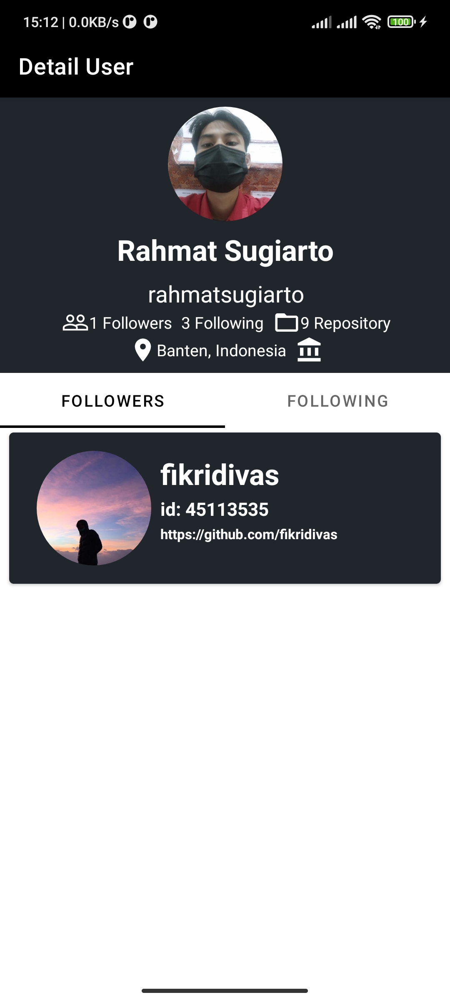
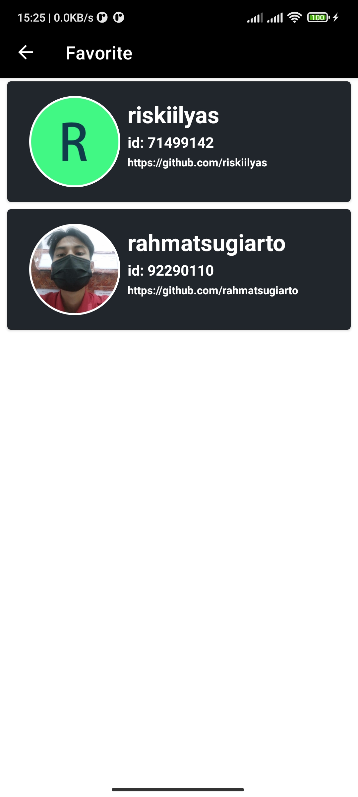
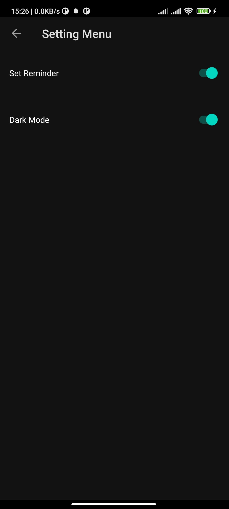
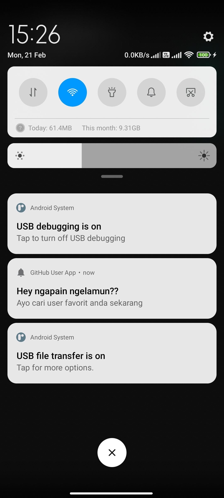

# GihubUser-AndroidApp
Dicoding Belajar Fundamental Aplikasi Android Submission

### Submission 1
#### Components:
1. RecyclerView
2. Explicit Intent with Parcelable
3. Circle Image
4. Constraint Layout

  
  

### Submission 2
#### Components:
1. RecyclerView
2. Explicit Intent
3. Glide
4. Constraint Layout
5. SearchView
6. View pager 2
7. Retrofit-Gson
8. ViewModel
9. Live Data

  
  

### Submission 3
#### Components:
1. RecyclerView
2. Explicit Intent
3. Glide
4. Constraint Layout
5. SearchView
6. View pager 2
7. Retrofit-Gson
8. ViewModel
9. Live Data
10. Room
11. DataStore
12. Shared Preferences
13. Collapsing Toolbar Layout
14. Tab Layout

  
  
  

